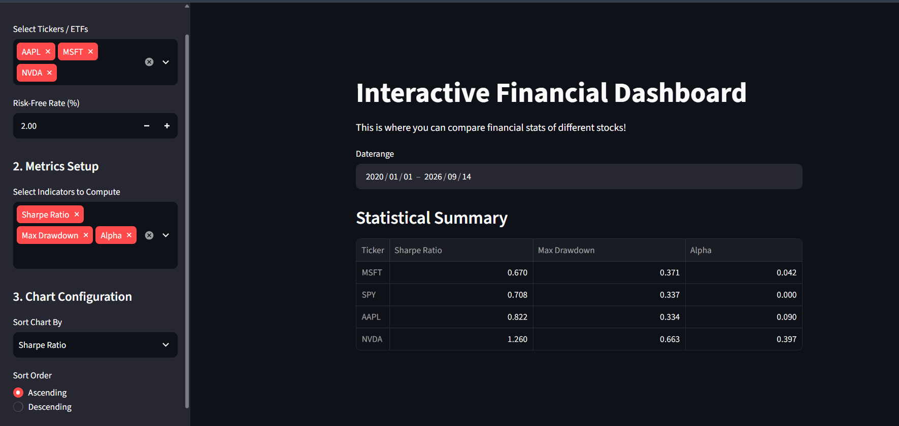

# Interactive Financial Dashboard

An interactive web application built with Streamlit that allows users to analyze, compare, and compute key financial metrics for various stocks and ETFs over custom timeframes.

## 🚀 Features

* **Custom Ticker Selection**: Compare multiple stocks or ETFs side-by-side (e.g., AAPL, MSFT, NVDA, SPY).
* **Adjustable Parameters**: Users can define specific date ranges and fine-tune the risk-free rate for accurate metric calculations.
* **Dynamic Metric Computation**: Automatically calculates critical financial statistics, including:
  * Sharpe Ratio
  * Maximum Drawdown
  * Alpha
  * Beta
  * Total Return
  * Annualized Return
  * Annualized Volatility
* **Interactive Data Visualization**: View results in a clean, sortable Statistical Summary table.
* **Persistent Market Data Cache**: Stores adjusted closing prices in SQLite and reuses them when the requested ticker/date range has already been fetched.

The cache database is created as `market_data_cache.sqlite3` in the project directory. A dashboard request makes at most one batched yfinance download for tickers whose requested date range is not fully cached; fully covered requests make no yfinance call. The selected start and end dates are both inclusive.

## 📸 Dashboard Preview



## 🛠️ Technologies Used

* **Python**: Core programming language.
* **Streamlit**: Used to build the interactive frontend user interface.
* **Pandas**: Used for data manipulation, cleaning, and metric computation.
* **yfinance (Yahoo Finance API)**: Used to fetch historical market data.

## ⚙️ Installation & Local Setup

To run this project locally, follow these steps:

1. **Clone the repository:**
   ```bash  
   git clone https://github.com/lullamore/FinanceDashboard.git
   ```
   ```bash
   cd FinanceDashboard
   ```
2. **Install the prereq:**
   ```bash
   pip install -r requirements.txt
   ```
3. **Run the application:**
   ```bash
   streamlit run main.py
   ```
   
